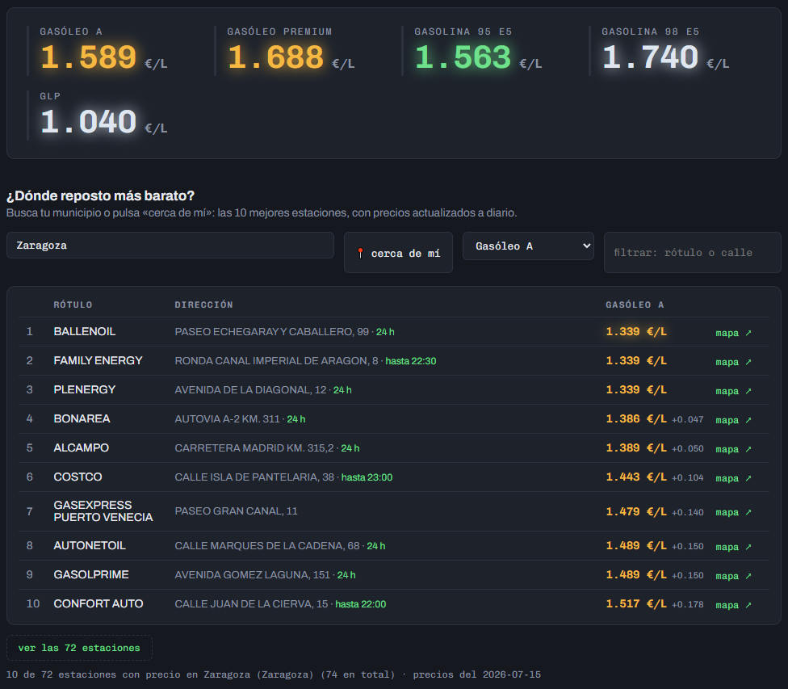
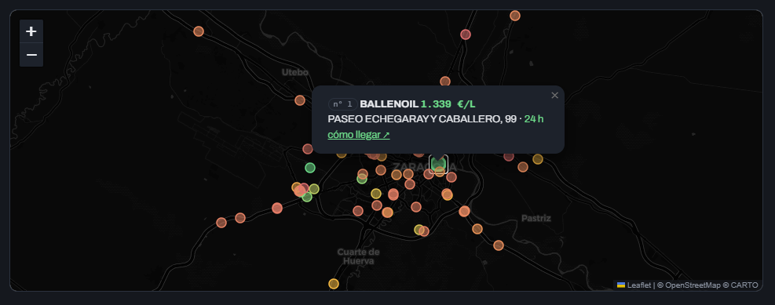

# Precios de carburantes en España

Pipeline ETL que descarga a diario los precios de las ~11.500 estaciones de servicio de España desde la [API de datos abiertos del MITECO](https://sedeaplicaciones.minetur.gob.es/ServiciosRESTCarburantes/PreciosCarburantes/EstacionesTerrestres/), los limpia con pandas, acumula agregados históricos y lo publica todo en una web estática con GitHub Pages.
GitHub Actions ejecuta el ETL cada mañana y la propia web se actualiza automáticamente.

**Web:** https://ivanaraque.github.io/precios-carburantes/





## Qué hace la web

- Panel con los precios medios del día: gasolina 95 y 98, gasóleo A y premium, GLP.
- Buscador por municipio (con autocompletado), filtro por rótulo o calle y ranking completo de estaciones.
- «Cerca de mí»: con tu ubicación, ordena las estaciones por **precio efectivo** (el precio del litro más el combustible del desvío de ida y vuelta) y muestra el ahorro en euros por repostaje frente a tu estación más cercana. Ir a 8 km a ahorrar una milésima no compensa, y la tabla lo refleja.
- Mapa con las estaciones coloreadas por precio (verde barata, rojiza cara) y estado de apertura: abierta, hasta qué hora, o cerrada ahora.
- Evolución del precio medio nacional (histórico desde julio de 2026) y comparativa de provincias
- Los enlaces llevan el municipio (`#teruel-teruel`), y la web recuerda tu municipio, producto y litros entre visitas.

## Arquitectura

```
GitHub Actions (cron diario + respaldo a mediodía)
        │
        ▼
etl/fetch_prices.py ──► descarga API ──► limpieza (pandas)
        │
        ├──► data/latest/estaciones.csv     snapshot completo del día
        ├──► docs/data/estaciones.json      estaciones por municipio (buscador y mapa)
        └──► docs/data/*.csv                histórico agregado
                    │
                    ▼
            GitHub Pages (docs/)
            dashboard, buscador y mapa
```

- El snapshot completo se sobreescribe cada día; el histórico solo guarda agregados (media, mediana, mínimo, máximo por producto, provincia y marca). Así el repo se mantiene ligero aunque acumule años de datos.
- El commit diario de datos lo hace el propio workflow.

## Datos generados

| Fichero | Contenido | Granularidad |
|---|---|---|
| `data/latest/estaciones.csv` | Snapshot con precios, coordenadas, horario y datos de cada estación | estación |
| `docs/data/estaciones.json` | Estaciones con dirección, coordenadas, precios y horario, agrupadas por municipio; alimenta el buscador y el mapa | municipio (se sobreescribe) |
| `docs/data/nacional.csv` | Media, mediana, mínimo y máximo por producto y día | producto × día |
| `docs/data/provincias.csv` | Precio medio por provincia, producto y día | provincia × producto × día |
| `docs/data/marcas.csv` | Precio medio de las 15 marcas con más estaciones | marca × producto × día |

## Decisiones de implementación

- **Descarga con dos clientes.** La API rechaza a ratos las conexiones desde los runners de GitHub (corta el handshake TLS), así que la descarga reintenta alternando `requests` y `curl`, que presentan huellas TLS distintas.
- **Doble cron idempotente.** GitHub descarta a veces los workflows programados en horas de carga; por eso hay una segunda cita a mediodía. Si corren ambas, la segunda simplemente reemplaza los datos del día — el histórico anexa por fecha y no duplica.
- **Horarios: mejor callar que mentir.** El estado abierta/cerrada se calcula interpretando el campo oficial de horario (`L-D: 24H`, `L-V: 06:00-22:00; S-D: ...`, rangos que cruzan la medianoche). Los horarios ambiguos —un solo día declarado, formatos raros— no muestran estado.
- **Precio efectivo.** El orden de «cerca de mí» reparte el coste del desvío (6,5 l/100 km, ida y vuelta) entre los litros del repostaje. Los supuestos están a la vista en la propia web.

## Puesta en marcha

```bash
pip install -r requirements.txt
python etl/fetch_prices.py
```

En GitHub:

1. Settings → Pages → Source: `main`, carpeta `/docs`
2. Settings → Actions → General → Workflow permissions: "Read and write permissions"
3. Actions → "etl diario" → Run workflow (primer snapshot manual)

A partir de ahí el workflow corre solo cada mañana.

## Fuente de los datos

Precios remitidos por las estaciones de servicio en cumplimiento de la Orden ITC/2308/2007 y publicados por el Ministerio para la Transición Ecológica y el Reto Demográfico.
